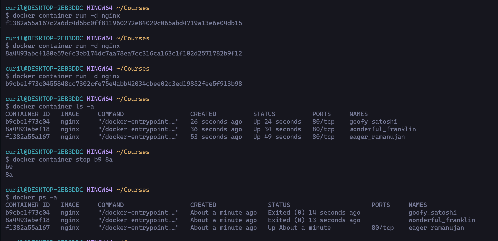

# Excercise
Start 3 containers from image that does not automatically exit, such as nginx, detached.

Stop 2 of the containers leaving 1 up.

Submit the output for docker ps -a which shows 2 stopped containers and one running.

# Solution
